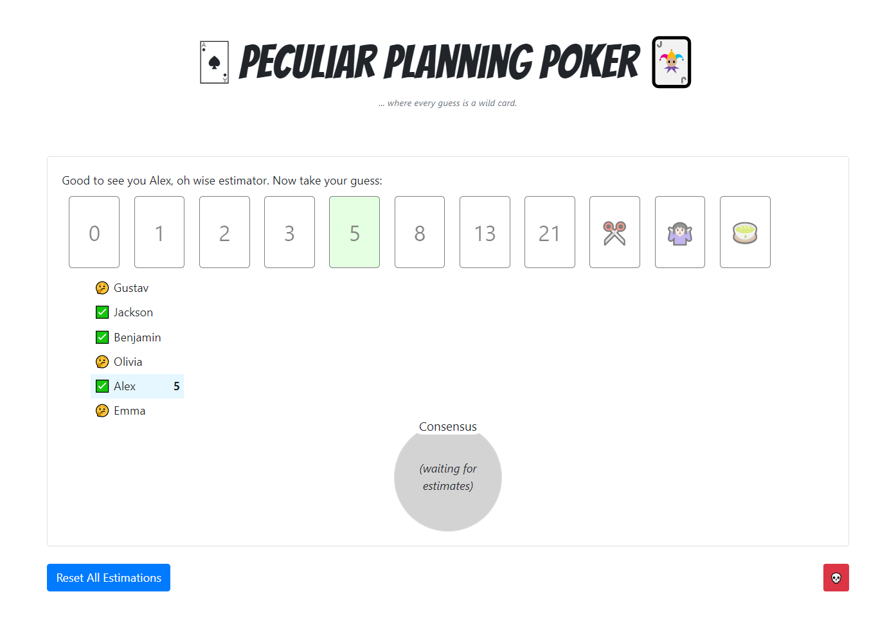
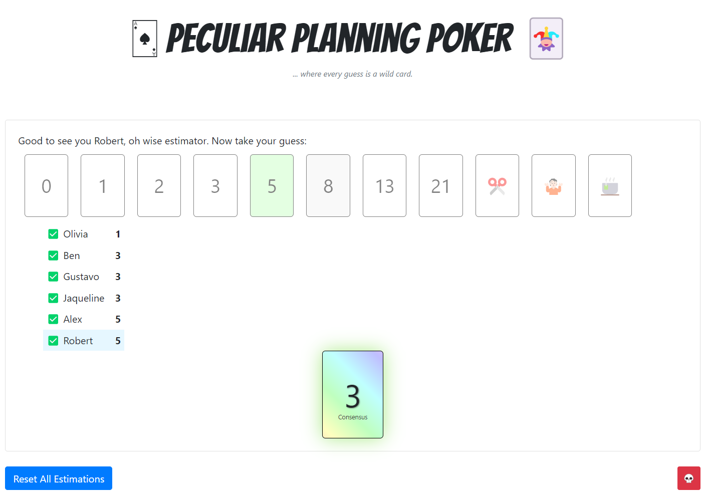

# Peculiar Planning Poker

A planning poker app for agile teams to estimate work items using the Fibonacci sequence.

  <kbd>
    
  </kbd>
   
   
  <kbd>
    
  </kbd>

## Example Procedure

Here is a typical procedure to use PPP during your agile ceremonies:

1. Log into PPP with your team.
2. Present a user story to estimate.
3. Ask the team to vote on the story by selecting a card.
4. Once everyone has voted, the most commonly selected card will be displayed.
5. Click "Reset All Estimations" to start the process again with a new user story.

Happy estimating! 

## Card Texts

To modify the card texts, edit the `valueToButtonLabel` map in [src/constants.js](src/constants.js).

## Usage

### Running the latest build

To run the latest build of PPP, you can use Docker:

1. Build the image: `docker build --build-arg REACT_APP_SERVER_HOSTNAME=<host name> -t ppp .` 
   * Replace `<host name>` with the host name of wherever you are hosting the backend server (i.e. "localhost" if you run it locally). Clients (i.e. browsers) will connect to this host. Defaults to "localhost" if not specified. I.e. for running both client + server on localhost, `docker build -t ppp .` is sufficient.
2. Run the container: `docker run -d --rm -p 3000:3000 -p 3001:3001 --name ppp ppp`
3. Open a web browser and go to: `http://<host name>:3000`

### Running PPP locally during development

To run PPP locally during development, you can follow these steps:

1. Clone this repository
2. Install dependencies: `yarn`
3. Start the server: `node server.js` (this will bind port 3001)
4. Start the React app: `yarn start` (this will bind port 3000)
5. Open a web browser and go to: `http://localhost:3000`

### Debugging server.js with VS Code

To debug the `server.js` file with VS Code, you can use the following steps:

1. Open the project in VS Code
2. Open the Debug view (`Ctrl + Shift + D` or `Cmd + Shift + D`)
3. Select "Debug Server" from the dropdown menu in the top menu bar
4. Set any necessary breakpoints in the `server.js` file
5. Press the "Start Debugging" button (green arrow) or hit `F5`
6. The server should start and pause on any set breakpoints

## Contributing
Contributions to this project are welcome! To get started, fork the repository, make changes, and submit a pull request. To work on an existing issue, feel free to assign yourself. For new bug reports or feature requests, please create a new issue.

For more information on contributing to GitHub projects, please see https://docs.github.com/en/get-started/quickstart/contributing-to-projects. Your contributions are appreciated, and thank you for considering to collaborate with this project!

## Developer Hints
The [server.js](server.js) manages the state of all users and estimations to ensure consistency among clients. 

### Useful Resources
* https://socket.io/docs/v4/emit-cheatsheet/
* https://dev.to/bravemaster619/how-to-use-socket-io-client-correctly-in-react-app-o65
